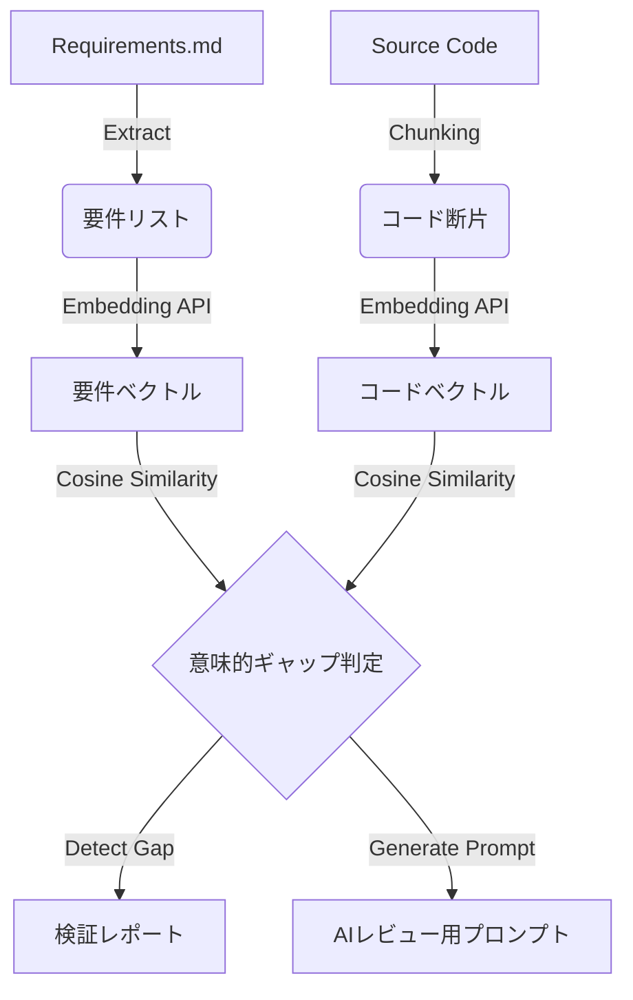

# 仕様書: Kiro統合および意味的検証 (Semantic Verification)

**Version:** 1.0 (Draft)
**Target:** Phase 1+
**Related:** `spec.md` Section 8.4, Issue-29

## 1. 概要 (Overview)

本仕様は、`omo-sdd-hybrid` における「仕様駆動開発（SDD）」のプロセスを強化するための拡張機能、**Kiro統合**および**意味的検証**について定義する。
従来の「物理的なファイルアクセス制御（Gatekeeper）」に加え、「論理的な仕様整合性（Logical Consistency）」を検証可能にすることで、AIエージェントによる自律的な品質保証を実現する。

### 1.1 目的

* **トレーサビリティの確保**: 自然言語で記述された要件（Requirements）と、実際のコード（Implementation）の間の追跡可能性を確立する。
* **意味的乖離の検出**: 単なるファイル存在確認にとどまらず、Embeddings（ベクトル検索）を用いて「実装が要件の意味を満たしているか」を機械的に判定する。
* **双方向同期**: 仕様変更とタスク進捗の不整合を防ぐ。

## 2. アーキテクチャ (Architecture)

### 2.1 コンポーネント構成

1. **Task Synchronizer (`sdd_sync_kiro`)**
* Kiro側の `tasks.md` と Gatekeeper側の `specs/tasks.md` を同期する。
* 責務: タスクのインポート、ステータス（TODO/DONE）の同期。

2. **Gap Analyzer (`sdd_validate_gap`)**
* 実装と仕様の差異を分析する主要エンジン。
* モード:
* **Basic**: ファイル存在確認、LSP診断、テスト実行。
* **Deep**: 設計カバレッジ分析、意味的検証（Semantic Verification）。

3. **Semantic Engine (`lib/embeddings-provider`, `lib/semantic-search`)**
* 要件とコードをベクトル化し、コサイン類似度で適合性を判定する。
* 外部のOpenAI互換APIを利用。

### 2.2 データフロー

## 3. 機能仕様 (Functional Specifications)

### 3.1 タスク同期 (`sdd_sync_kiro`)

* **トリガー**: ユーザーまたはエージェントによるツール実行。
* **同期ルール**:
1. **Import**: `.kiro/specs/<feature>/tasks.md` に存在し、`specs/tasks.md` に存在しないタスクIDを、`specs/tasks.md` に追記する。
* Scopeは自動的に `<feature>` ディレクトリに設定される。

2. **Status Sync**: 両方に存在するタスクIDについて、`[x]` (完了) 状態を同期する。
* 矛盾する場合の優先順位: `specs/tasks.md` (実装側) の状態を正とする（※実装完了をもって仕様も完了とみなす運用）。

### 3.2 ギャップ分析 (`sdd_validate_gap`)

#### 3.2.1 Deep Analysis モード (`--deep`)

`--deep` フラグ付与時に以下の拡張検証を実行する。

1. **設計カバレッジ分析**:
* `design.md` からコンポーネント定義を抽出。
* Gitの変更差分と比較し、「設計にあるが実装されていないファイル」および「設計にないファイルの実装（Unexpected Implementation）」を検出する。

2. **意味的検証 (Semantic Verification)**:
* **前提**: 環境変数による Embeddings API の設定が必要。
* **プロセス**:
1. `requirements.md` から要件項目を抽出。
2. 変更されたファイルのコード内容を取得。
3. 要件とコードの類似度を計算。
4. 類似度が閾値（デフォルト 0.75）未満の要件を「Gapあり」としてレポートする。

### 3.3 レポート出力

検証結果は以下のセクションを含むテキストとして出力される。

1. **スコープ検証**: 許可されたパス外への変更有無。
2. **診断結果**: コンパイルエラー等の有無。
3. **Kiro統合ステータス**:
* 仕様ファイルの完備状況。
* （Deep時）設計カバレッジ。
* （Deep時）意味的ギャップ検出結果。
* （Deep時）AIレビュー用プロンプト（`
`タグで折りたたみ表示）。

## 4. 設定と環境変数 (Configuration)

意味的検証を有効にするために、以下の環境変数を設定する。

| 変数名 | 必須 | デフォルト値 | 説明 |
| --- | --- | --- | --- |
| `SDD_EMBEDDINGS_API_KEY` | Yes | - | OpenAI互換APIのキー |
| `SDD_EMBEDDINGS_API_BASE` | No | `https://api.openai.com/v1` | APIのエンドポイント |
| `SDD_EMBEDDINGS_MODEL` | No | `text-embedding-3-small` | 使用するモデル名 |
| `SDD_EMBEDDINGS_THRESHOLD` | No | `0.75` | ギャップ判定の類似度閾値 (0.0 - 1.0) |
| `SDD_KIRO_DIR` | No | `.kiro` | Kiro仕様のルートディレクトリ |

※ `SDD_EMBEDDINGS_API_KEY` が未設定の場合、意味的検証はスキップされ、その旨がレポートに表示される（エラーにはならない）。

## 5. エラーハンドリングと制限事項

* **API障害**: Embeddings APIへの接続に失敗した場合、検証プロセス全体を止めず、意味的検証のみを「Error/Skip」として扱い、他の検証結果を出力する。
* **トークン制限**: 巨大なファイルは適切なチャンクサイズで分割、または先頭一定量のみをベクトル化対象とする（性能とコストのバランス）。
* **Git依存**: 変更差分の検出には `git` コマンドが利用可能であること。

## 6. 将来の拡張 (Future Roadmap)

* **自動修正提案**: 検出された意味的ギャップに対し、修正コード案を自動生成する機能。
* **マルチモーダル対応**: 設計図（画像）とコードの比較検証。
* **Quality Gate連携**: CIパイプライン上で `sdd_validate_gap` を実行し、マージをブロックする機能。
